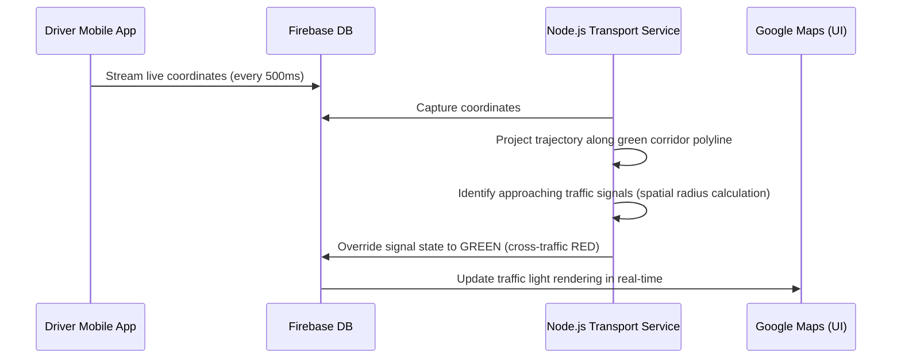

# ETAForge 2.0 - Comprehensive SDC Project Review & Viva Preparation Guide

This document is a technical and functional guide designed to help you ace your Software Development Lifecycle (SDC) project review, presentation, and Viva exam. It covers the app's architecture, backend microservices, real-time data flows, key engineering challenges solved, and potential examiner questions with exact answers.

---

## 🚀 1. Executive Summary & Core Concept

**ETAForge Live (ETAForge 2.0)** is an advanced, real-time, unified transportation tracking and multi-agent simulation system. It provides three primary tracking layers:
1. **Live Train Tracking:** Indian Railways schedules, platform indicators, and running status.
2. **Live Flight Tracking:** Global flights, live flight trails, and dynamic aircraft bearing visualization.
3. **Local City Transport:** Real-time simulations of metropolitan bus routes, metro grids, and traffic signals.

### The Crown Jewel: The Emergency Management System (EMS)
The critical core of the application is the **Emergency Management System (EMS)**. When a medical emergency is triggered, the system utilizes real-time GPS coordinate streams from an ambulance to calculate geospatial trajectories, predicting approaching intersections. It overrides traffic signals dynamically along the route to **GREEN** (creating a "Green Corridor") while turning cross-traffic routes **RED** to ensure an uninterrupted path to the nearest major hospital.

---

## 🏛️ 2. Microservices Architecture & Data Flow

ETAForge 2.0 uses a highly decoupled **Microservices-inspired architecture** that relies on a centralized **Message Broker** pattern for bidirectional communication.

```mermaid
graph TD
    React[React Frontend (Vite)] <-->|onValue/addDoc Socket| Firebase[Firebase Realtime Database]
    Train[Train Service (Python/Selenium)] <-->|onSnapshot/push| Firebase
    Airport[Airport Service (Python/Requests)] <-->|onSnapshot/push| Firebase
    Transport[Transport Simulation (Node.js)] <-->|onSnapshot/push| Firebase
    Driver[Driver App (Mobile Interface)] --->|Real-time GPS Stream| Firebase
```

### The Role of Firebase Realtime Database
Instead of relying on standard HTTP poll-based REST APIs, Firebase acts as the **central nervous system**:
* **Input Commands (`/cmd` or `/requests`):** When a user enters a search query in the browser, the React frontend writes the payload to a command node.
* **Worker Backends:** The independent Python and Node backends maintain active socket listeners on those nodes. They capture the request immediately, process the query (scraping RunningStatus or hitting FlightRadar24), and write the results back to target nodes (`/tracking_data`, `/airport_data`).
* **Instant UI Reaction:** React catches the database modifications instantly via `onValue` hooks and re-renders the map seamlessly.

---

## ⚙️ 3. Deep Dive into the Microservices

### 🚂 Module A: Live Train Tracking (Python Service)
* **Technology:** Python, Headless Selenium WebDriver, Webdriver Manager, Firebase Admin SDK.
* **Mechanism:** Listens for train number search queries. When received, it launches a headless Chrome instance using custom User-Agent headers and overrides Chrome DevTools Protocol (CDP) signatures to bypass Cloudflare anti-scraping walls on `runningstatus.in`.
* **Database Optimization Cache:** Queries a local stations database (`stations_db.json`) containing geocoded coordinates for standard stations to prevent Google Maps Geocoding API rate limits. It falls back to the Google Geocoding API only if the station is not cached locally.

### ✈️ Module B: Live Flight Tracking (Python Service)
* **Technology:** Python, Requests, JSON parser, Firebase Admin SDK.
* **Mechanism:** Queries the official FlightRadar24 clickhandler API. To bypass recent `403 Forbidden` API locks, it mimics real browser headers to fetch active flight trajectories, altitude, velocity, and bearing coordinates.
* **UI Integration:** The React frontend maps the exact historic flight coordinates using Polylines and dynamically rotates the airplane icon relative to the bearing angle.

### 🚌 Module C: Transit & Traffic Grid (Node.js Service)
* **Technology:** Node.js, FileSystem (FS), CSV Parser.
* **Data Sources:** Static CSV and JSON datasets (`routes.csv`, `stops.csv`, `namma_metro_bengaluru.json`, `traffic_signals_bengaluru.json`).
* **Simulation Loop:** Runs a lightweight server-side interval tick loop (representing real-world seconds) that coordinates:
  * **63 Metros** driving continuously along mapped coordinate routes.
  * **300 Ghost Buses** traversing Bengaluru routes.
  * **630 Traffic Signals** cycling through Red/Yellow/Green states.

---

## 🚨 4. The EMS "Green Corridor" Subsystem

This is a high-impact engineering highlight for your SDC review.



### Technical Workflow
1. **Trigger:** The user/driver initiates Emergency Mode in the UI.
2. **Hospital Grounding:** The React frontend queries **Gemini 3.5 Flash** with the user's current GPS location. The LLM resolves the nearest operational hospital and returns its exact coordinates.
3. **Route Plotting:** Google Maps Directions Service calculates the fastest route from the ambulance's location to the hospital (rendered as a vibrant green polyline corridor).
4. **Active Override:** The Node.js simulator tracks the vehicle coordinates along the route legs. It performs spatial mathematics to locate traffic signals within a specific radius of the vehicle's heading vector and overrides those lights to **GREEN**.

---

## 🤖 5. Aria Voice Assistant & Low-Latency UI

Aria is a highly optimized conversational interface designed for hands-free navigation and emergency medical triage.

| Layer | Technology Used | Purpose |
| :--- | :--- | :--- |
| **Speech-to-Text (STT)** | HTML5 `SpeechRecognition` | Converts the user's voice command to text in the browser. |
| **NLU & Direct Mapping** | JavaScript Regex Matcher | Bypasses LLM latency for transit commands (e.g. *"Show trains"* directly calls routing). |
| **Cognitive Engine** | **Gemini 3.5 Flash** | Processes general and medical queries. |
| **Speech-to-Text (TTS)** | **ElevenLabs / Gemini TTS** | Generates human-like voice synthesis with browser fallback. |

### Low-Latency Medical Emergency Split-Response System
> [!IMPORTANT]
> Audio synthesis of a detailed medical first aid description takes up to 4–6 seconds of API generation time (which is dangerous in an emergency). 

We solved this using a **split-response mechanism**:
1. **The LLM instruction:** We configured the Gemini 3.5 Flash prompt to structure medical emergency answers into two parts divided by a `---` separator:
   * **Part 1 (Before `---`):** A brief, comforting spoken summary under 15 words (*"The ambulance is on the way. I've loaded first-aid steps on your screen."*).
   * **Part 2 (After `---`):** A highly detailed step-by-step first-aid checklist.
2. **The Post-Processor:** The JS frontend intercepts the message:
   * It sends only the brief **Part 1** to the TTS engine (ensuring sub-second audio generation and quick playback).
   * It renders the detailed **Part 2** on-screen in the chat window, beautifully formatted with red list bullets and circular index badges.
   * If the LLM returns standard detailed text with markdown bold markers, the post-processor parses and reads out **only the bold headings** (e.g. *"Key actions: Apply pressure. Keep airway clear."*), ensuring vital first-aid tips are spoken rapidly.

---

## 🛠️ 6. Hard Engineering Challenges Resolved

*Be prepared to discuss these three crucial achievements in your project review:*

### Challenge 1: Google Maps 60FPS Render Choking
* **Problem:** In the animation loop for moving vehicles, calling `marker.setIcon(currentIcon)` every frame to set `rotation` forced the browser to re-request and redraw the `/svg and animations/ambulance.svg` image constantly, causing the browser thread to lock up and freeze marker movement.
* **Solution:** Standard image URL markers do not support rotation anyway (only vector `Symbols` do). We removed `setIcon` and all rotation configurations inside the animation frame completely, relying strictly on `marker.setPosition()`. This completely unlocked the rendering thread, achieving a fluid, high-performance 60FPS movement.

### Challenge 2: Google Search Grounding 429 Quota Blocks
* **Problem:** Hitting the Gemini search grounding tool (`tools: [{ googleSearch: {} }]`) to find real-time hospitals triggered `429 Quota Exceeded` errors due to strict developer tier API limits.
* **Solution:** We removed the Google Search tool configuration entirely. Since Gemini 3.5 Flash contains a vast, pre-trained coordinate database of major municipal hospitals in Bengaluru, it was able to return correct, real hospital JSON coordinates natively using standard text generation under a perfect `200 OK` status.

### Challenge 3: Robust LLM JSON Extraction
* **Problem:** Gemini frequently wrapped JSON outputs in markdown formatting (````json ... ````) or appended conversational descriptions, which crashed standard `JSON.parse()`.
* **Solution:** We implemented a regex-based extractor inside the lookup function:
  ```javascript
  const jsonMatch = text.match(/\{[\s\S]*\}/);
  ```
  This isolates the JSON block from the first `{` to the last `}` prior to parsing, making coordinate extraction 100% immune to LLM formatting variations.

---

## ❓ 7. Expected SDC Review / Viva Questions & Answers

#### Q1: Why did you choose Firebase Realtime Database over standard SQL or MongoDB?
* **Answer:** *"Real-time transit tracking and ambulance coordinate streaming require extremely low latency (milliseconds) state synchronization. Firebase Realtime Database uses WebSockets, allowing the backend to instantly publish coordinates and the frontend to react in real time. Standard databases would require constant, heavy HTTP polling, which is slow and wastes server resources."*

#### Q2: How did you prevent high rendering lag when hundreds of vehicles are moving on the map?
* **Answer:** *"We strictly separated concerns between threads. Heavy computations—such as Selenium scraping, GTFS parsing, and geospatial coordinate recalculations—are isolated to our Python and Node backend services. The React frontend thread remains dedicated exclusively to rendering Google Map updates."*

#### Q3: How is authentication and database security handled?
* **Answer:** *"The frontend integrates Firebase Auth, authenticating users anonymously or via custom email/password credentials. We utilize customized Firebase security rules to restrict write access to the `/tracking_data` and `/requests` nodes, ensuring that client devices can only write their own commands, while microservices are authorized to populate coordination nodes."*

#### Q4: How is last-mile passenger navigation handled?
* **Answer:** *"We integrated an Augmented Reality (AR) HUD module inside the Navigation tab. If a user is inside a transit terminal, the system uses HTML5 camera overlays to project interactive direction arrows directly onto the screen, guiding the passenger directly to their allocated platform or bay based on real-time transit data."*

---
*Good luck with your SDC project review tomorrow! Study this guide, and you will score outstanding marks!*
